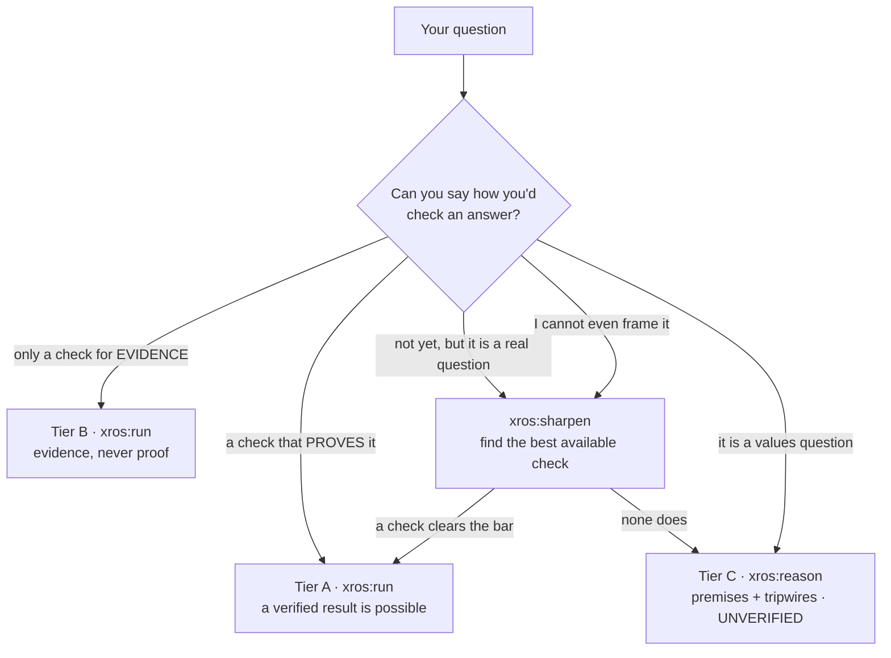

# XROS — an executable research operating system

[](https://github.com/xiaolai/xros-for-claude/blob/main/nlpm-badge.json)

**Frame a question, then find out** — whether you arrive with a proof checker or with
nothing but the question. XROS turns an investigation into a **verifiable methodology
spec**, runs it against a **real check**, and gates the verdict on that check's exit
code.

> **No verification, no claim.** XROS reports a result as verified only when a mechanical
> check actually passed. Where no such check exists, it says so and refuses the strong
> mode — instead of producing confident text with nothing anchoring it.

## Who it's for

The same machinery serves two users at once:

- **The professional** brings the domain knowledge — they can name the check, the
  failure modes, the approaches. XROS gives them the full research protocol: a fleet of
  independent routes, adversarial refutation, and a verdict gated on their own real
  check. Nothing is taken on trust.
- **The newcomer** brings only the question. XROS does the rest *with* them, in plain
  language: it asks "how would you check an answer?" instead of demanding jargon; it
  researches how a field actually verifies claims and hands back a learning report; it
  proposes the failure modes and approaches for the user to ratify, and marks every
  borrowed idea so the reported confidence stays honest.

The safety design protects the newcomer most of all: **the person least able to tell a
confident answer from a correct one is exactly the person a "no verification, no claim"
rule defends.**

## Built for the unknown — and the unknown unknown

Software usually assumes you already know the question and how to answer it. XROS is
built for the step before that.

- **A known unknown** — a question you can pose but not yet answer — is what the engine
  is for: independent routes attack it, skeptics try to refute each result, and only a
  check settles it.
- **An unknown unknown** — you don't know how to ask, what would count as an answer, or
  how people get fooled in this field — is what `sharpen` is for. It turns a vague
  question into a falsifiable one, discovers the field's own way of checking such claims,
  and surfaces the standard traps. That is the act of turning an unknown unknown into a
  known unknown: now you know what to check, and what to watch for.

Where you stand decides which command runs:



## The four commands

| Command | The move |
|---------|----------|
| `/xros:compile` | Interview → a validated spec. Asks, in plain language, how you would check an answer *before* anything else; hands off to `sharpen` when you can't |
| `/xros:sharpen` | Vague or un-checkable question → a falsifiable claim + the **currently best available** check (with a plain statement of what it *cannot* establish), or an honest "no check clears the soundness bar" |
| `/xros:run` | Tier A/B spec → a multi-agent Workflow (independent routes, adversarial refutation, counterexample-fed loop) → runs your check and gates on its exit code. A Tier-C spec is redirected to `xros:reason` — the engine never runs without a check |
| `/xros:reason` | The Tier-C path for a claim with no mechanical check: decompose into premises and verify the checkable ones, run a pre-mortem, emit dated tripwires. All output labeled UNVERIFIED |

## The tier model — the safety mechanism

One property decides everything: **does passing your check actually establish your
claim?** It is recorded as `verifier.soundness` and enforced by the schema, not by
convention.

| Tier | `soundness` | Example checks | What XROS does |
|------|-------------|----------------|----------------|
| **A** | `sound` | proof checker (Lean/Coq), model check over a full bounded space, type check, compile, exhaustive test | Full engine. May return a **verified complete** result |
| **B** | `statistical` | held-out backtest, benchmark, sampled experiment, fuzzing | Engine runs, but the verdict is **evidence only** — never "complete" |
| **C** | `none` | human judgment only | **Engine does not run.** Output is labeled UNVERIFIED |

The tiers are structurally binding. A `backtest` can never be marked `sound`; a
statistical or absent check can never request `complete-only`. You cannot shop for a
weak check to unlock the strong mode — the schema rejects it.

## Under the hood

**The spec** — a single JSON file conforming to `schema/xros-spec.schema.json`. It
encodes the anatomy of a serious investigation: precise definitions, one fully-quantified
claim, an explicit **non-goals** list (things that look like success but aren't), a
diverse portfolio of approaches, a domain-specific adversarial checklist, stopping and
budget rules, and the check itself. Worked examples, one per tier, live in
`schema/examples/` and `schema/tests/valid/`.

**Validation** — a bundled, dependency-free validator (Python standard library only; no
`jsonschema`, no `npx`, no network):

```bash
python3 schema/tools/xros_validate.py schema/xros-spec.schema.json <your-spec>.json
# exit 0 = VALID · 1 = INVALID · 2 = usage/IO/schema fault
```

It enforces the schema plus three gates JSON Schema cannot express (`maxRounds >=
minRounds`, at least 3 distinct approach families, unique approach names), and runs a
**schema preflight** that refuses to run on any keyword it does not implement — so
validation can never silently fail open.

**Tests**:

```bash
python3 schema/tests/run.py       # XROS_STRICT=1 in CI requires the jsonschema parity lane
```

Valid specs, isolated structural negatives, semantic gates, validator unit vectors,
robustness (malformed input must yield a clean INVALID, never a traceback), the CLI
contract, and **mutation testing**: each safety rule is deleted from the schema in turn,
and its negative test must stop failing — the only real proof that a test targets the
rule it claims to.

## Status

v0.1.0 — all four commands ship. The schema, the validator, and the conformance suite are
the load-bearing, tested parts; the command bodies are natural-language programs whose
rigor rests on their instructions (and on the reviews that hardened them). No spec has
been driven end-to-end through a live `run`, so treat the orchestration as
validated-by-review, not battle-tested.

## Where it came from

The methodology is modeled on the prompt OpenAI published alongside its Cycle Double
Cover proof: precise definitions, exhaustive non-goals, a diverse portfolio developed
independently before cross-pollination, adversarial audit with domain-specific failure
modes, and a stopping rule gated on surviving that audit. XROS's addition is the part
that made that work trustworthy rather than merely productive: **the external check is
mandatory, and the system refuses to pretend when it is missing.**

- **The full origin story** — our reading of the Reddit thread, the two OpenAI documents,
  and how they shaped this design: [`why-this-plugin/`](why-this-plugin/README.md)
- **OpenAI source documents:**
  [CDC prompt](https://cdn.openai.com/pdf/04d1d1e4-bc75-476a-97cf-49055cd98d31/cdc_prompt.pdf)
  · [CDC proof](https://cdn.openai.com/pdf/04d1d1e4-bc75-476a-97cf-49055cd98d31/cdc_proof.pdf)
  · [r/math thread](https://www.reddit.com/r/math/comments/1uxj3cy/after_openais_cdc_proof_announcement_gpt56_used_a/)

MIT licensed.
