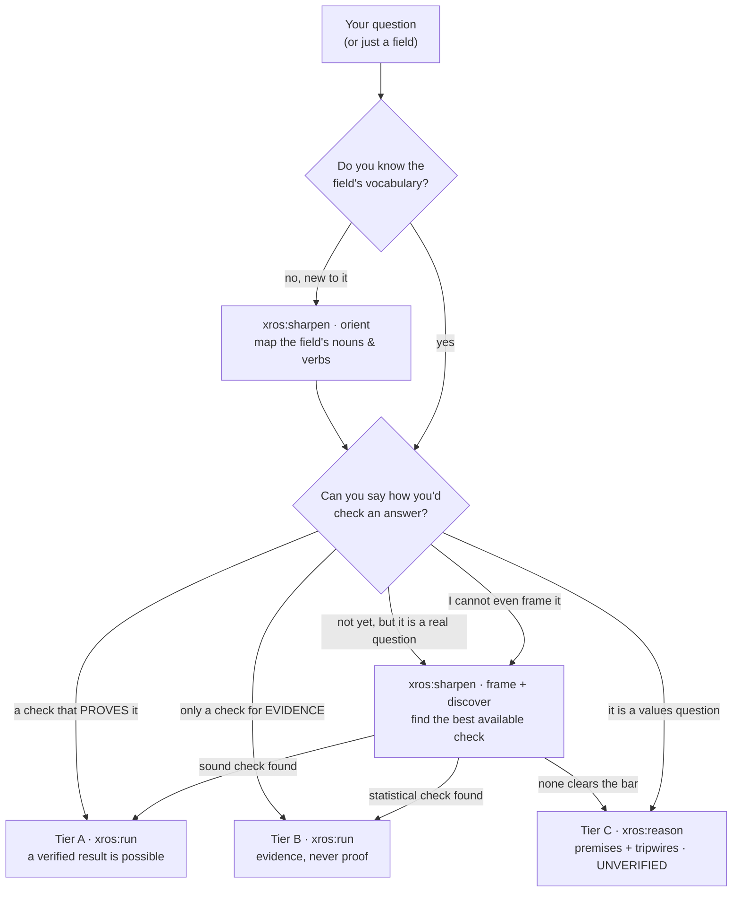

# XROS — an eXecutable Research Operating System

**XROS** = **eX**ecutable **R**esearch **O**perating **S**ystem.

[](https://github.com/xiaolai/xros/blob/main/nlpm-badge.json)

XROS is a **plugin for AI coding agents** — you install it into your assistant and drive
it with four capabilities: **compile**, **sharpen**, **run**, and **reason**. It installs
natively on **Claude Code, OpenAI Codex, Google Antigravity, and xAI Grok** from this one
repo — as slash commands on Claude Code (`/xros:run`), as skills everywhere else
(`$xros-run`). Jump to [Install](#install), [Using XROS](#using-xros), or
[how it travels across hosts](#how-it-travels-across-hosts) — or read on for what it does.

**Frame a question, then find out** — whether you arrive with a proof checker or with
nothing but the question. XROS turns an investigation into a **verifiable methodology
spec**, runs it against a **real check**, and gates the verdict on that check's exit
code.

> **No verification, no claim.** XROS reports a result as verified only when a mechanical
> check actually passed. Where no such check exists, it says so and refuses the strong
> mode — instead of producing confident text with nothing anchoring it.

## Install

XROS ships as **one repo that four hosts can install natively**. Pick yours.

Everything requires **Python 3** (standard library only) for the bundled validator —
no `jsonschema`, no `npx`, no network. Restart the host after installing so the four
capabilities register.

### Claude Code

```bash
claude plugin marketplace add xiaolai/claude-plugin-marketplace
claude plugin install xros@xiaolai --scope project   # or --scope user
```

> **Install fails with "Plugin not found in marketplace 'xiaolai'"?** Your local
> marketplace clone is stale. Run `claude plugin marketplace update xiaolai` and retry —
> `plugin install` does not auto-refresh.

| Scope | Command | Effect |
|-------|---------|--------|
| **User** (default) | `claude plugin install xros@xiaolai --scope user` | Available in all your projects |
| **Project** | `claude plugin install xros@xiaolai --scope project` | Shared with your team via `.claude/settings.json` |
| **Local** | `claude plugin install xros@xiaolai --scope local` | Only you, only this repo |

### OpenAI Codex

Codex installs from a marketplace through an **in-session TUI**, not a shell verb.
Register the marketplace once in your shell:

```bash
codex plugin marketplace add xiaolai/claude-plugin-marketplace
```

Then open Codex and run `/plugins`, pick **xros**, and start a new session so its
skills load.

### Google Antigravity

Antigravity installs a plugin straight from its Git repo (requires Antigravity CLI
**1.1.0+**):

```bash
agy plugin install https://github.com/xiaolai/xros
agy plugin list
```

Pin to a release by cloning the tag first, then installing the local checkout:

```bash
git clone --branch v0.3.0 --depth 1 https://github.com/xiaolai/xros.git
agy plugin install ./xros
```

### xAI Grok

Grok installs directly from GitHub. `--trust` is required:

```bash
grok plugin install xiaolai/xros --trust
grok plugin list
```

Or pin it, which is the safer habit:

```bash
grok plugin install xiaolai/xros@v0.3.0 --trust
```

Grok also reads Claude Code marketplaces automatically, so if you already have the
`xiaolai` marketplace registered you can simply `grok plugin install xros --trust`.
Each skill becomes a slash command — `/xros-run <spec>.json`.

## Who it's for

The same machinery serves two users at once:

- **The professional** brings the domain knowledge — they can name the check, the
  failure modes, the approaches. XROS gives them the full research protocol: a fleet of
  independent routes, adversarial refutation, and a verdict gated on their own real
  check. Nothing is taken on trust.
- **The newcomer** brings only the question. XROS does the rest *with* them, in plain
  language: it asks "how would you check an answer?" instead of demanding jargon; it
  researches how a field actually verifies claims and hands back a learning report; it
  proposes the failure modes and approaches for the user to ratify, and marks every
  borrowed idea so the reported confidence stays honest.

The safety design protects the newcomer most of all: **the person least able to tell a
confident answer from a correct one is exactly the person a "no verification, no claim"
rule defends.**

## Built for the unknown — and the unknown unknown

Software usually assumes you already know the question and how to answer it. XROS is
built for the step before that. The arc is **expand → frame → check**:

- **Expand** — you don't even know the field's words. An unknown unknown is first a
  *vocabulary* gap: you can't ask about `syuzhet` if you've never heard it, and you
  can't check what you can't name. `sharpen`'s **orient** step maps the field's minimal
  handles — the **nouns** you can ask about and the **verbs** you can do — each graded
  by how settled it is and cited to a real source. That turns an unknown unknown into a
  known unknown.
- **Frame** — a question you can pose but not yet answer (a *known unknown*). `sharpen`
  turns it into a falsifiable claim: one with a stated observation that would prove it
  wrong.
- **Check** — the engine settles it: independent routes attack the claim, skeptics try
  to refute each result, and only a real check (`run`) or honest tripwires (`reason`)
  close it out.

### Why "expand" is a new learning paradigm

The old way to learn a field is to search with the words you already have and narrow
toward an answer. In an unfamiliar field that fails *silently*: you can't search for `fabula` or
`syuzhet` if you've never heard the word, and the gap is invisible to you — an unknown
unknown feels exactly like knowing everything.

Expanding search scope inverts the move. **Before** narrowing, you ask the field for its
minimal set of load-bearing **nouns** (what you can ask about) and **verbs** (what you
can do), and get back the handles that let you form a question at all. It is
**expand-then-narrow**, not narrow-only — and one cheap query converts a wall of unknown
unknowns into a short list of known unknowns, which is the exact moment a real inquiry
can begin. (This is the move that "kick-starts" newcomers: hand someone *fabula*,
*syuzhet*, and *information control* and they can suddenly ask real questions about
storytelling.)

Two things make it a paradigm shift, not a trick: an AI can draw the map cheaply — a
fraction of the old cost of acquiring a field's vocabulary — so expanding scope first is
now a rational opening move in an unfamiliar field; and XROS keeps it honest — the
`orient` step grades each term canonical/coinage/contested, cites it, and drops any it
cannot attest, and once a graded term enters a spec the schema enforces its sources (a
`canonical` term needs two). The map is a scaffold for asking, never mistaken for mastery.

Where you stand decides which command runs:



## The four commands

Four commands cover the whole arc. If the field is new to you, start at `sharpen`; if
you can already state the question and how you'd check it, start at `compile`; `run`
*checks* a Tier-A/B result, while `reason` structures an explicitly **unverified**
Tier-C decision (premises + future tripwires) — it does not settle the claim now.

| Command | What it does for you |
|---------|----------------------|
| `/xros:compile` | Interview → a validated spec. Asks, in plain language, how you would check an answer *before* anything else; hands off to `sharpen` when you can't |
| `/xros:sharpen` | **Orient → frame → discover.** Maps an unfamiliar field's minimal vocabulary (the nouns you can ask about, the verbs you can do), turns a vague question into a falsifiable claim, then finds the **currently best available** check (with a plain statement of what it *cannot* establish), or an honest "no check clears the soundness bar" |
| `/xros:run` | Tier A/B spec → a multi-agent Workflow (independent routes, adversarial refutation, counterexample-fed loop) → runs your check and gates on its exit code. A Tier-C spec is redirected to `xros:reason` — the engine never runs without a check |
| `/xros:reason` | The Tier-C path for a claim with no mechanical check: decompose into premises and verify the checkable ones, run a pre-mortem, emit dated tripwires. All output labeled UNVERIFIED |

## Using XROS

Once installed, you invoke XROS **inside your assistant** — on Claude Code type `/xros:`
and the four commands appear; on Codex, Antigravity, and Grok they are skills, invoked as
`$xros-run` (Grok also exposes each as a slash command, `/xros-run`). You don't run a
binary or edit config; you talk to it and it interviews you. Where you start depends on
where you stand (the map above decides it):

```text
/xros:sharpen     # new to the field, or can't yet say how you'd check an answer:
                  #   orient (map the field's nouns & verbs) → frame → discover a check

/xros:compile     # you can already state the question and how you'd check it:
                  #   an interview that produces a validated spec

/xros:run         # you have a Tier-A/B spec: the multi-agent engine runs it and
                  #   gates the verdict on your check's exit code

/xros:reason      # no mechanical check exists (Tier C): premises + pre-mortem +
                  #   dated tripwires, all labelled UNVERIFIED
```

A first-timer typically runs `sharpen` → `compile` → `run`. A domain expert who already
has the check can start straight at `compile`. Every command writes a spec conforming to
`schema/xros-spec.schema.json`; you can also hand-write one and validate it yourself
before a run:

```bash
python3 schema/tools/xros_validate.py schema/xros-spec.schema.json <your-spec>.json
# exit 0 = VALID · 1 = INVALID · 2 = usage/IO/schema fault
```

Worked specs — one per tier — live in `schema/examples/` and `schema/tests/valid/` to
copy from.

## How it travels across hosts

One repo, four native installs. The four capabilities are expressed on two surfaces:

| Surface | Host | Artifacts |
|---------|------|-----------|
| Slash commands | Claude Code | `claude/commands/*.md` |
| Skills | Codex · Antigravity · Grok | `skills/xros-*/SKILL.md` |

`skills/` is a **single shared tree**: Codex, Antigravity, and Grok all implement the
same `skills/<name>/SKILL.md` contract, so the same four files serve all three. Only
the manifests differ — `.codex-plugin/plugin.json`, the root `plugin.json`
(Antigravity), and `.grok-plugin/plugin.json`.

**What is identical everywhere.** The part that does the verifying: the JSON spec
schema, the dependency-free validator, the three-tier model, and the rule that the
verdict is gated on the oracle's exit code. `schema/tools/xros_validate.py` is
stdlib-only Python and does not care which AI wrote the spec.

**What genuinely differs — stated plainly.** The Claude Code build runs the search on a
real multi-agent Workflow: every route and every skeptic is a separate agent with its
own context. The skills describe that same algorithm as a protocol the host executes
with **its own** sub-agents (Grok's `spawn_subagent`, Antigravity's sub-agents) — or,
where a host exposes no sub-agent primitive, sequentially within one context.

Sequential single-agent role-play is **weaker independence than separate agents**, and
independence is exactly what makes a portfolio of routes and a slate of refutation votes
mean anything. So `$xros-run` is required to report which dispatch mode it actually ran.
The *guarantee* — no verification, no claim — is identical on every host; the *strength
of the search* that precedes it is not.

That is why the repo is `xros`, not `xros-for-claude`.

## The tier model — the safety mechanism

One property decides everything: **does passing your check actually establish your
claim?** It is recorded as `verifier.soundness` and enforced by the schema, not by
convention.

| Tier | `soundness` | Example checks | What XROS does |
|------|-------------|----------------|----------------|
| **A** | `sound` | proof checker (Lean/Coq), model check over a full bounded space, type check, compile, exhaustive test | Full engine. May return a **verified complete** result |
| **B** | `statistical` | held-out backtest, benchmark, sampled experiment, fuzzing | Engine runs, but the verdict is **evidence only** — never "complete" |
| **C** | `none` | human judgment only | **Engine does not run.** Output is labeled UNVERIFIED |

The tiers are structurally binding. A `backtest` can never be marked `sound`; a
statistical or absent check can never request `complete-only`. You cannot shop for a
weak check to unlock the strong mode — the schema rejects it.

## Under the hood

**The spec** — a single JSON file conforming to `schema/xros-spec.schema.json`. It
encodes the anatomy of a serious investigation: precise definitions, one fully-quantified
claim, an explicit **non-goals** list (things that look like success but aren't), a
diverse portfolio of approaches, a domain-specific adversarial checklist, stopping and
budget rules, and the check itself. Worked examples, one per tier, live in
`schema/examples/` and `schema/tests/valid/`.

**Validation** — a bundled, dependency-free validator (Python standard library only; no
`jsonschema`, no `npx`, no network):

```bash
python3 schema/tools/xros_validate.py schema/xros-spec.schema.json <your-spec>.json
# exit 0 = VALID · 1 = INVALID · 2 = usage/IO/schema fault
```

It enforces the schema plus three gates JSON Schema cannot express (`maxRounds >=
minRounds`, at least 3 distinct approach families, unique approach names), and runs a
**schema preflight** that refuses to run on any keyword it does not implement — so
validation can never silently fail open.

**Tests**:

```bash
python3 schema/tests/run.py       # XROS_STRICT=1 in CI requires the jsonschema parity lane
```

Valid specs, isolated structural negatives, semantic gates, validator unit vectors,
robustness (malformed input must yield a clean INVALID, never a traceback), the CLI
contract, and **mutation testing**: each safety rule is deleted from the schema in turn,
and its negative test must stop failing — the only real proof that a test targets the
rule it claims to.

## Status

v0.2.0 — all four commands ship (compile, sharpen with the orient step, run, reason). The
schema, the validator, and the conformance suite are
the load-bearing, tested parts; the command bodies are natural-language programs whose
rigor rests on their instructions (and on the reviews that hardened them). No spec has
been driven end-to-end through a live `run`, so treat the orchestration as
validated-by-review, not battle-tested.

## Where it came from

The methodology is modeled on the prompt OpenAI published alongside its Cycle Double
Cover proof: precise definitions, exhaustive non-goals, a diverse portfolio developed
independently before cross-pollination, adversarial audit with domain-specific failure
modes, and a stopping rule gated on surviving that audit. XROS's addition is the part
that made that work trustworthy rather than merely productive: **the external check is
mandatory, and the system refuses to pretend when it is missing.**

- **The full origin story** — our reading of the Reddit thread, the two OpenAI documents,
  and how they shaped this design: [`why-this-plugin/`](why-this-plugin/README.md)
- **OpenAI source documents:**
  [CDC prompt](https://cdn.openai.com/pdf/04d1d1e4-bc75-476a-97cf-49055cd98d31/cdc_prompt.pdf)
  · [CDC proof](https://cdn.openai.com/pdf/04d1d1e4-bc75-476a-97cf-49055cd98d31/cdc_proof.pdf)
  · [r/math thread](https://www.reddit.com/r/math/comments/1uxj3cy/after_openais_cdc_proof_announcement_gpt56_used_a/)

MIT licensed.
